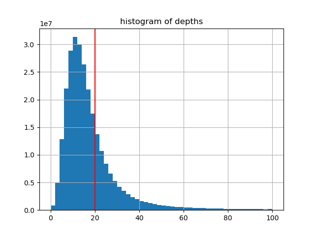
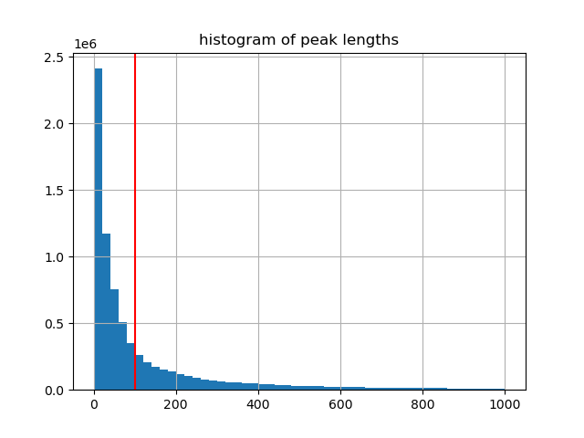
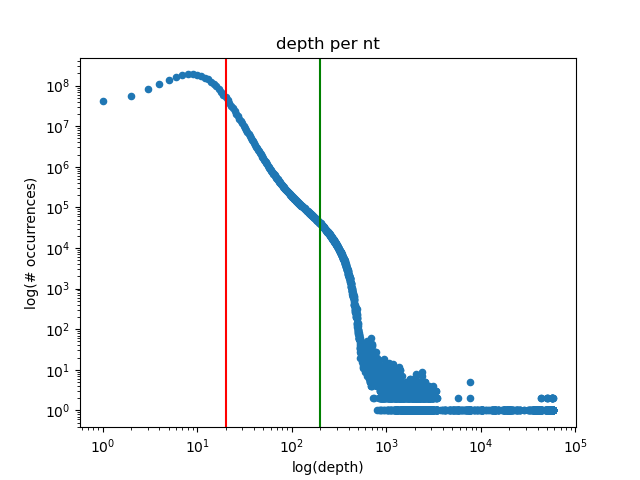

# Calling Peaks
Now that we have the number of reads (read depth) at each coordinate in the genome, we have to define what a signal peak is, and where they are, so that we can then look for the closest genomic elements using another bedtools tool. 
# What is a peak
Given we are only interested in open chromatin, and ATAC seq peaks should be relatively sparse, we need to set a threshold depth at which we call something a peak, and below that is noise. We will use this value in the peak calling algorithm. We also arent interested in short peaks fluctuating over and under this threshold, so we perform a filtering step to trash peaks with lengths shorter than 100:

Read depth distribution (input file):
```python3
import pandas as pd
import matplotlib.pyplot as plt
data=pd.read_csv('/Users/pfb2024/Downloads/MA8_genome_cov_bg.txt',sep='\t',header=None)
data.hist(column=3,range=[0,100],bins=50)
plt.axvline(x=20, color = 'red')
plt.title('counts')
```


Peak length distribution (after calling all peaks regardless of length):
```python3
data2=pd.read_csv('/Users/pfb2024/Lola-seq/ma8_test_bg.txt',sep='\t',header=None) #unfiltered peaks
data2['length']=data2[2]-data2[1] #calculate length
data2.hist(column='length',range=[0,1000],bins=50)
plt.axvline(x=100, color = 'red')
```


# Peak calling script
```python3
#!usr/bin/env python3

import sys

inputfile=sys.argv[1]
outputfile=sys.argv[2]
depththreshold=sys.argv[3]
lengththreshold=sys.argv[4]
peaks=[]

#ensure both arguments are present, else exit
if len(sys.argv) != 5:
    print(f'Usage: {sys.argv[0]} <input file name> <output file name> <depth threshold for peaks> <length threshold for peaks>')
    exit(1)

#input file format looks like:
#'Chromosome' \t nt coordinate startstreak \t nt coordinate endstreak \t ATAC read count depth
with open(inputfile,'r') as file: #open input file
    in_peak=False #are we in a peak or not? start false
    for line in file:
        line=line.rstrip()
        base=line.split('\t') #split into list: ['chromosome',coordinate,count]
        if int(base[3]) > depththreshold and in_peak == False: #if count is eg. 20 or more and we are out of a peak:
            in_peak=True #change to in peak
            start_coord=int(base[1]) #remember start of peak coordinate
        if int(base[3]) <= depththreshold and in_peak == True: #if count is less than eg. 20 and we are in a peak:
            in_peak = False #we are no longer in the peak
            end_coord=int(base[1]) #remember end of peak coordinate
            peaks.append([base[0],start_coord,end_coord]) #add the peak to list of peaks ['chr1',startcoord,endcoord]

#filter out short peaks (eg. 100 or less bases)
filtered_peaks=[]
for peak in peaks:
    if peak[2]-peak[1] > lengththreshold: #if peak is 100 or more nts:
        filtered_peaks.append(peak) #add to filtered peaks list
    else: #skip if not
        continue
#write output file tsv
with open(outputfile,'w') as output:
    for peak in filtered_peaks:
        output.write(f'{peak[0]}\t{peak[1]}\t{peak[2]}\n')
output.close()
```
Running the script:
```bash
$python3 Peak_calling.py MA8_genome_cov_bg.txt MA8_genome_peaks.txt 20 100
```
Now we can pass output to bedtools assignClosest to get nearest genomic features for the peaks.

```bash
$head -10 MA8_genome_peaks.txt
chr1    10103   10339
chr1    181061  181163
chr1    181357  181627
chr1    191297  191679
chr1    631501  631696
chr1    634593  634715
chr1    777624  778145
chr1    778230  779483
chr1    779684  780045
chr1    816972  817508
```

# nb
When we calculated depth using the fragments, we used bedtools GenomeCov -bg to reduce file size. Thus, these lines:
```bash
chr1    10078   10079   3
chr1    10079   10084   5
chr1    10084   10085   7
chr1    10085   10090   9
```
represent the following:
```bash
chr1    10078    3
chr1    10079    5
chr1    10080    5
chr1    10081    5
chr1    10082    5
chr1    10083    5
chr1    10084    7
chr1    10085    9
chr1    10086    9
chr1    10087    9
chr1    10088    9
chr1    10089    9
...
```
To more accurately look at this distribution on a per base basis for the entire genome:

```python3
newdepth={} #{[depthcount:occurences in genome]}
with open('/Users/pfb2024/Downloads/MA8_genome_cov_bg.txt','r') as genomecor:
    for line in genomecor:
        line=line.rstrip()
        values=line.split('\t')
        if int(values[3]) in newdepth: #if depthcount already appears in dictionary
            newdepth[int(values[3])]+=int(values[2])-int(values[1]) #add length of occurences
        else:
            newdepth[int(values[3])]=int(values[2])-int(values[1]) #if not add to it and set as length
newdepths=pd.DataFrame(newdepth.items())
sortednewdepths=newdepths.sort_values(by=0)

sortednewdepths.plot.scatter(0,1,loglog=True)
plt.title('depth per nt')
plt.xlabel('log(depth)')
plt.ylabel('log(# occurrences)')
plt.axvline(x=20, color = 'red')
plt.axvline(x=200, color = 'green')
```


Perhaps we could increase the depth threshold for a peak to 200 or so (green) from 20 (red)
